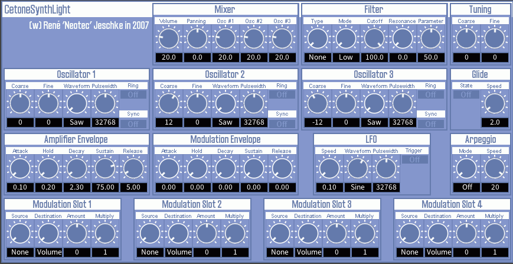

# CetoneSynthLight

CetoneSynthLight is a light-weight monophonic synthesizer by Neotec Software. It aims to give you a light but professional synthesizer experience. **Originally written by [René Jeschke](https://github.com/rjeschke).**

Sadly, Cetone Synth series had been discontinued for more than 12 years (since 2012), and it only supported VST 2.4. Original project is [here](https://github.com/rjeschke/cetonesynths).

**But now, I (AnClark) brings it to life again, by re-implementing those plugins to [DISTRHO Plugin Framework](https://distrho.github.io/DPF/).** It now runs well on most modern platforms.



## Features

- **3 oscillators with 5 waveforms**
  - Basic waveforms: Sine, Saw, Triangle, Square (pulse)
  - **Nintendo® C64™-style noise generator** (switch waveform to "Noise")
- **Analog-modelled filter**
  - **Support 7 classic filter models**: Moog, Moog2, Dirty, Ch12db, x0x, 8580, Bi12db
  - Switchable filter mode
  - Resonance support
- **4 modulation slots**
  - Specify source and destination correspondingly
  - Tunable modulation amount and multiply factor
- 1 basic LFO
- 2 AHDSR envelopes
  - Amplifier AHDSR
  - Modulation AHDSR
- Glide (portamento) support
- Simple arpeggiator
- **Cross-platform**
  - Supports: Windows, macOS, Linux
- **Multi-format**
  - Provides: VST 2.4, VST3, LV2, CLAP, Standalone (JACK only)

## How To Build

### 0. Prerequisites

You need to install GCC, CMake, GNU Make and Ninja on your platform. Ninja is highly recommended for its high performance.

### On Linux

```bash
# Ubuntu
sudo apt update
sudo apt install gcc cmake make ninja

# Arch Linux
sudo pacman -Syu
sudo pacman -S gcc cmake make ninja
```

### On Windows

**You need to install Msys2 to build Cetone Synth series.** Download and install it from <https://msys2.org>.

After installation, run **MSYS2 UCRT64 Shell** from desktop (or Start Menu), then execute these commands:

```bash
pacman -Syu
pacman -S mingw-w64-ucrt-x86_64-gcc mingw-w64-ucrt-x86_64-cmake mingw-w64-ucrt-x86_64-ninja
pacman -S make
```

You can also install Git in Msys2, if you need:

```bash
pacman -S git
```

**Every command below should be executed in MSYS2 UCRT64 Shell.**

### 1. Clone source tree

```bash
# Source tree has 1 submodule: DPF. So you need to add --recursive
git clone https://github.com/AnClark/Minaton-XT.git minaton --recursive

# If you forget --recursive, run this
cd minaton
git submodule update --init --recursive
```

### 2. Build

Cetone series now use CMake as build system. **All platforms share the same commands**.

You can explicitly specify built type here. For best performance, `Release` build is recommended. Optionally you can also set build type to `Debug`.

```bash
cd minaton
cmake -S . -B build -DCMAKE_BUILD_TYPE=Release
cmake --build build
```

Built plug-ins reside in `build/bin`. Copy plugins to your DAW's search paths.

## License

- [René's original repo](https://github.com/rjeschke/cetonesynths) is provided 'as is' and license free for public use.
- This repository is licensed under GNU GPLv3.

## Credits

- [René Jeschke](https://github.com/rjeschke) - Original author
- [AnClark Liu](https://github.com/AnClark) - Maintainer of this repository. Re-implemented CetoneSynthLight to DPF.